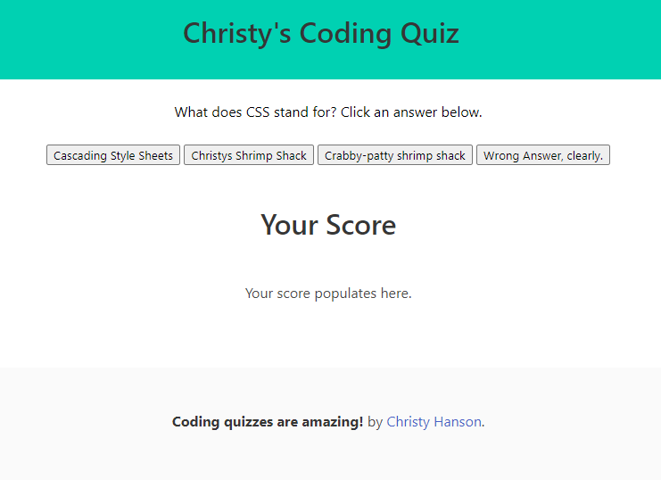

# Christy's Coding Quiz

## Description 

* This coding quiz asks the user questions related to web development. The user selects an answer in an attempt to get a high score. 

* The score increases by 1 for correct answers.
* The score decrements by 5 for each incorrect answer.

## Screenshot

# URLs for Graders
URL for remote repo: https://github.com/ChristyGHanson/my-code-quiz
URL for live webpage: https://christyghanson.github.io/my-code-quiz/

